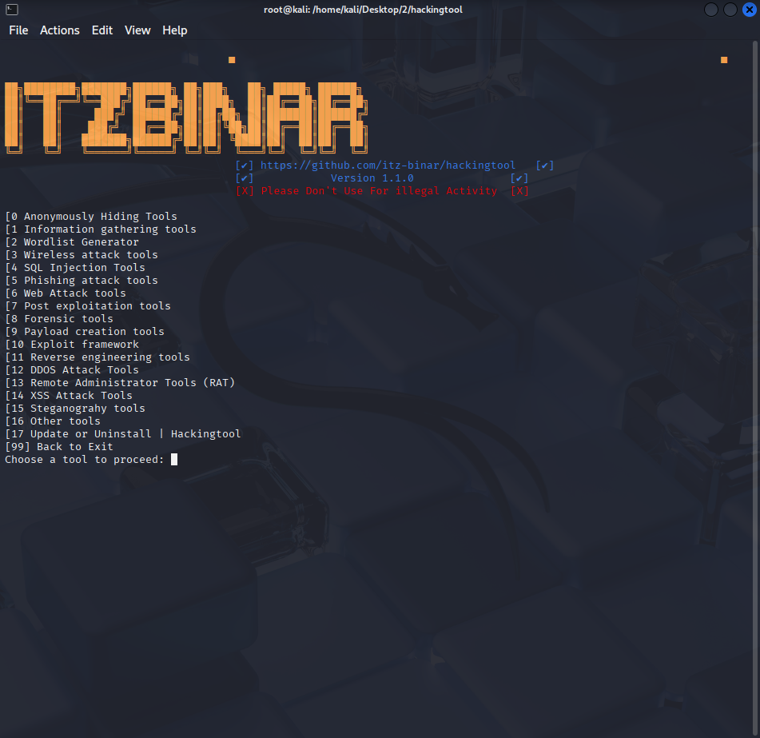

<p align="center">
  
</p>

<h1 align="center">All in One Hacking tool For Hackers🥇</h1>

#### Install Kali Linux in Windows10 Without VirtualBox [YOUTUBE](https://youtu.be/BsFhpIDcd9I) or use Docker

## Update Available V1.2.0 🚀 
- [✔] Installation Bug Fixed
- [x] Added New Tools 
    - [x] Reverse Engineering
    - [x] RAT Tools
    - [x] Web Crawling 
    - [x] Payload Injector
- [x] Multitor Tools update
- [X] Added Tool in wifijamming
- [X] Added Tool in steganography


# Hackingtool Menu 🧰
- [Anonymously Hiding Tools](#anonymously-hiding-tools)
- [Information gathering tools](#information-gathering-tools)
- [Wordlist Generator](#wordlist-generator)
- [Wireless attack tools](#wireless-attack-tools)
- [SQL Injection Tools](#sql-injection-tools)
- [Phishing attack tools](#phishing-attack-tools)
- [Web Attack tools](#web-attack-tools)
- [Post exploitation tools](#post-exploitation-tools)
- [Forensic tools](#forensic-tools)
- [Payload creation tools](#payload-creation-tools)
- [Exploit framework](#exploit-framework)
- [Reverse engineering tools](#reverse-engineering-tools)
- [DDOS Attack Tools](#ddos-attack-tools)
- [Remote Administrator Tools (RAT)](#remote-administrator-tools--rat-)
- [XSS Attack Tools](#xss-attack-tools)
- [Steganograhy tools](#steganograhy-tools)
- [Other tools](#other-tools)
    - [SocialMedia Bruteforce](#socialmedia-bruteforce)
    - [Android Hacking tools](#android-hacking-tools)
    - [IDN Homograph Attack](#idn-homograph-attack)
    - [Email Verify tools](#email-verify-tools)
    - [Hash cracking tools](#hash-cracking-tools)
    - [Wifi Deauthenticate](#wifi-deauthenticate)
    - [SocialMedia Finder](#socialmedia-finder)
    - [Payload Injector](#payload-injector)
    - [Web crawling](#web-crawling)
    - [Mix tools](#mix-tools)


### Anonymously Hiding Tools
- [Anonmously Surf](https://github.com/Und3rf10w/kali-anonsurf)
- [Multitor](https://github.com/trimstray/multitor)
### Information gathering tools
- [Network Map (nmap)](https://github.com/nmap/nmap)
- [Dracnmap](https://github.com/Screetsec/Dracnmap)
- Port scanning
- Host to IP 
- [Xerosploit](https://github.com/LionSec/xerosploit)
- [RED HAWK (All In One Scanning)](https://github.com/Tuhinshubhra/RED_HAWK)
- [ReconSpider(For All Scanning)](https://github.com/bhavsec/reconspider)
- IsItDown (Check Website Down/Up)
- [Infoga - Email OSINT](https://github.com/m4ll0k/Infoga)
- [ReconDog](https://github.com/s0md3v/ReconDog)
- [Striker](https://github.com/s0md3v/Striker)
- [SecretFinder (like API & etc)](https://github.com/m4ll0k/SecretFinder)
- [Find Info Using Shodan](https://github.com/m4ll0k/Shodanfy.py)
- [Port Scanner - rang3r (Python 2.7)](https://github.com/floriankunushevci/rang3r)
- [Port Scanner - Ranger Reloaded (Python 3+)](https://github.com/joeyagreco/ranger-reloaded)
- [Breacher](https://github.com/s0md3v/Breacher)
### Wordlist Generator
- [Cupp](https://github.com/Mebus/cupp.git)
- [WordlistCreator](https://github.com/wlcreator)
- [Goblin WordGenerator](https://github.com/UndeadSec/GoblinWordGenerator.git)
- [Password list (1.4 Billion Clear Text Password)](https://github.com/Viralmaniar/SMWYG-Show-Me-What-You-Got)
### Wireless attack tools
- [WiFi-Pumpkin](https://github.com/P0cL4bs/wifipumpkin3)
- [pixiewps](https://github.com/wiire/pixiewps)
- [Bluetooth Honeypot GUI Framework](https://github.com/andrewmichaelsmith/bluepot)
- [Fluxion](https://github.com/thehackingsage/Fluxion)
- [Wifiphisher](https://github.com/wifiphisher/wifiphisher)
- [Wifite](https://github.com/derv82/wifite2)
- [EvilTwin](https://github.com/fakeap)
- [Fastssh](https://github.com/fastssh)
- Howmanypeople
### SQL Injection Tools
- [Sqlmap tool](https://github.com/sqlmapproject/sqlmap)
- [NoSqlMap](https://github.com/codingo/NoSQLMap)
- [Damn Small SQLi Scanner](https://github.com/stamparm/DSSS)
- [Explo](https://github.com/dtag-dev-sec/explo)
- [Blisqy - Exploit Time-based blind-SQL injection](https://github.com/JohnTroony/Blisqy)
- [Leviathan - Wide Range Mass Audit Toolkit](https://github.com/leviathan-framework/leviathan)
- [SQLScan](https://github.com/Cvar1984/sqlscan)
### Phishing attack tools
- [Setoolkit](https://github.com/trustedsec/social-engineer-toolkit)
- [SocialFish](https://github.com/UndeadSec/SocialFish)
- [HiddenEye](https://github.com/DarkSecDevelopers/HiddenEye)
- [Evilginx2](https://github.com/kgretzky/evilginx2)
- [I-See_You(Get Location using phishing attack)](https://github.com/Viralmaniar/I-See-You)
- [SayCheese (Grab target's Webcam Shots)](https://github.com/hangetzzu/saycheese)
- [QR Code Jacking](https://github.com/cryptedwolf/ohmyqr)
- [ShellPhish](https://github.com/An0nUD4Y/shellphish)
- [BlackPhish](https://github.com/iinc0gnit0/BlackPhish)
### Web Attack tools
- [Web2Attack](https://github.com/santatic/web2attack)
- Skipfish
- [SubDomain Finder](https://github.com/aboul3la/Sublist3r)
- [CheckURL](https://github.com/UndeadSec/checkURL)
- [Blazy(Also Find ClickJacking)](https://github.com/UltimateHackers/Blazy)
- [Sub-Domain TakeOver](https://github.com/edoardottt/takeover)
- [Dirb](https://gitlab.com/kalilinux/packages/dirb)
### Post exploitation tools
- [Vegile - Ghost In The Shell](https://github.com/Screetsec/Vegile)
- [Chrome Keylogger](https://github.com/UndeadSec/HeraKeylogger)
### Forensic tools
- Autopsy
- Wireshark
- [Bulk extractor](https://github.com/simsong/bulk_extractor)
- [Disk Clone and ISO Image Acquire](https://guymager.sourceforge.io/)
- [Toolsley](https://www.toolsley.com/)
- [Volatility3](https://github.com/volatilityfoundation/volatility3/)
### Payload creation tools
- [The FatRat](https://github.com/Screetsec/TheFatRat)
- [Brutal](https://github.com/Screetsec/Brutal)
- [Stitch](https://nathanlopez.github.io/Stitch)
- [MSFvenom Payload Creator](https://github.com/g0tmi1k/msfpc)
- [Venom Shellcode Generator](https://github.com/r00t-3xp10it/venom)
- [Spycam](https://github.com/indexnotfound404/spycam)
- [Mob-Droid](https://github.com/kinghacker0/Mob-Droid)
- [Enigma](https://github.com/UndeadSec/Enigma)
### Exploit framework
- [RouterSploit](https://github.com/threat9/routersploit)
- [WebSploit](https://github.com/The404Hacking/websploit )
- [Commix](https://github.com/commixproject/commix)
- [Web2Attack](https://github.com/santatic/web2attack)
### Reverse engineering tools
- [Androguard](https://github.com/androguard/androguard )
- [Apk2Gold](https://github.com/lxdvs/apk2gold )
- [JadX](https://github.com/skylot/jadx)
### DDOS Attack Tools
- SlowLoris
- [Asyncrone | Multifunction SYN Flood DDoS Weapon](https://github.com/fatihsnsy/aSYNcrone)
- [UFOnet](https://github.com/epsylon/ufonet)
- [GoldenEye](https://github.com/jseidl/GoldenEye)
### Remote Administrator Tools (RAT)
- [Stitch](https://github.com/nathanlopez/Stitch)
- [Pyshell](https://github.com/knassar702/pyshell)
### XSS Attack Tools
- [DalFox(Finder of XSS)](https://github.com/hahwul/dalfox)
- [XSS Payload Generator](https://github.com/capture0x/XSS-LOADER.git)
- [Extended XSS Searcher and Finder](https://github.com/Damian89/extended-xss-search)
- [XSS-Freak](https://github.com/PR0PH3CY33/XSS-Freak)
- [XSpear](https://github.com/hahwul/XSpear)
- [XSSCon](https://github.com/menkrep1337/XSSCon)
- [XanXSS](https://github.com/Ekultek/XanXSS)
- [Advanced XSS Detection Suite](https://github.com/UltimateHackers/XSStrike)
- [RVuln](https://github.com/iinc0gnit0/RVuln)
- [Cyclops](https://github.com/v8blink/Chromium-based-XSS-Taint-Tracking) 
### Steganograhy tools
- SteganoHide
- StegnoCracker
- [StegoCracker](https://github.com/W1LDN16H7/StegoCracker)
- [Whitespace](https://github.com/beardog108/snow10)
### Other tools
#### SocialMedia Bruteforce
- [Instagram Attack](https://github.com/chinoogawa/instaBrute)
- [AllinOne SocialMedia Attack](https://github.com/Matrix07ksa/Brute_Force)
- [Facebook Attack](https://github.com/Matrix07ksa/Brute_Force)
- [Application Checker](https://github.com/jakuta-tech/underhanded)
#### Android Hacking tools
- [Keydroid](https://github.com/F4dl0/keydroid)
- [MySMS](https://github.com/papusingh2sms/mysms)
- [Lockphish (Grab target LOCK PIN)](https://github.com/JasonJerry/lockphish)
- [DroidCam (Capture Image)](https://github.com/kinghacker0/WishFish)
- [EvilApp (Hijack Session)](https://github.com/crypticterminal/EvilApp)
- [HatCloud(Bypass CloudFlare for IP)](https://github.com/HatBashBR/HatCloud)
#### IDN Homograph Attack
- [EvilURL](https://github.com/UndeadSec/EvilURL)
#### Email Verify tools
- [Knockmail](https://github.com/4w4k3/KnockMail)
#### Hash cracking tools
- [Hash Buster](https://github.com/s0md3v/Hash-Buster)
#### Wifi Deauthenticate
- [WifiJammer-NG](https://github.com/MisterBianco/wifijammer-ng)
- [KawaiiDeauther](https://github.com/aryanrtm/KawaiiDeauther)
#### SocialMedia Finder
- [Find SocialMedia By Facial Recognation System](https://github.com/Greenwolf/social_mapper)
- [Find SocialMedia By UserName](https://github.com/xHak9x/finduser)
- [Sherlock](https://github.com/sherlock-project/sherlock)
- [SocialScan | Username or Email](https://github.com/iojw/socialscan)
#### Payload Injector
- [Debinject](https://github.com/UndeadSec/Debinject)
- [Pixload](https://github.com/chinarulezzz/pixload)
#### Web crawling
- [Gospider](https://github.com/jaeles-project/gospider)
#### Mix tools
- Terminal Multiplexer
- [Crivo](https://github.com/GMDSantana/crivo)

## Installation For Linux

### !! RUN HACKINGTOOL AS ROOT !! 

## Step-by-Step Installation Guide

### Step 1: Download hackingtool

```bash
git clone https://github.com/itz-binar/hackingtool.git
```

### Step 2: Give Permission to hackingtool
    
```bash
chmod -R 755 hackingtool
```

### Step 3: Move to hackingtool directory

```bash
cd hackingtool
```

### Step 4: Run installation script
    
```bash
sudo bash install.sh
```

### Step 5: Fix any path issues (recommended)

Create and run the fix script to prevent path-related errors:

```bash
# Create fix_path.sh with the content from the troubleshooting section
cat > fix_path.sh << 'EOL'
#!/bin/bash

# Fix the hackingtool path issue
echo "Fixing hackingtool path issue..."

# Define path file location and default path
PATHFILE=~/hackingtoolpath.txt
TOOLSPATH="/home/kali/hackingtool"

# Create directory if it doesn't exist
mkdir -p "$TOOLSPATH"

# Delete path file if empty or overwrite with correct content
if [ -f "$PATHFILE" ] && [ ! -s "$PATHFILE" ]; then
    echo "Empty path file found. Removing..."
    rm "$PATHFILE"
fi

# Create or overwrite path file
echo "$TOOLSPATH" > "$PATHFILE"
echo "Path file updated with: $TOOLSPATH"

# Test read the file
echo "Current path file content: $(cat $PATHFILE)"

echo "Fix complete. You can now run 'sudo hackingtool'"
EOL

# Make it executable and run it
chmod +x fix_path.sh
sudo ./fix_path.sh
```

### Step 6: Run hackingtool
    
```bash
sudo hackingtool
```

## Troubleshooting Common Issues

### 1. Directory Path Error

If you encounter a directory error like this:

```
/usr/local/bin/hackingtool: line 2: cd: /home/kali/Desktop/2/hackingtool: No such file or directory
```

Create a custom launcher script:

```bash
# Create a file named hackingtool_launcher.sh with the content below
#!/bin/bash

cd /path/to/your/hackingtool  # Replace with your actual path
# Create virtualenv if it doesn't exist
if [ ! -d "venv" ]; then
    python3 -m venv venv
    source venv/bin/activate
    pip install -r requirements.txt
else
    source venv/bin/activate
fi

# Run the tool
python3 hackingtool.py
```

Then install it:

```bash
chmod +x hackingtool_launcher.sh
sudo cp hackingtool_launcher.sh /usr/local/bin/hackingtool
```

### 2. Empty Path File Error

If you encounter this error:

```
FileNotFoundError: [Errno 2] No such file or directory: ''
```

This happens because the path file (`~/hackingtoolpath.txt`) is empty or doesn't exist. Create a fix script:

```bash
# Create a file named fix_path.sh with the content below
#!/bin/bash

# Fix the hackingtool path issue
echo "Fixing hackingtool path issue..."

# Define path file location and default path
PATHFILE=~/hackingtoolpath.txt
TOOLSPATH="/home/kali/hackingtool"

# Create directory if it doesn't exist
mkdir -p "$TOOLSPATH"

# Delete path file if empty or overwrite with correct content
if [ -f "$PATHFILE" ] && [ ! -s "$PATHFILE" ]; then
    echo "Empty path file found. Removing..."
    rm "$PATHFILE"
fi

# Create or overwrite path file
echo "$TOOLSPATH" > "$PATHFILE"
echo "Path file updated with: $TOOLSPATH"

# Test read the file
echo "Current path file content: $(cat $PATHFILE)"

echo "Fix complete. You can now run 'sudo hackingtool'"
```

Run the fix script:

```bash
chmod +x fix_path.sh
sudo ./fix_path.sh
```

### 3. Complete Reinstallation

If you continue to have issues, try a complete reinstallation:

```bash
# Remove existing installation
sudo rm -rf /usr/share/hackingtool
sudo rm /usr/local/bin/hackingtool
rm -f ~/hackingtoolpath.txt

# Clone the repository again
git clone https://github.com/itz-binar/hackingtool.git
cd hackingtool
chmod +x install.sh
sudo ./install.sh

# Fix path issue if needed
echo "/home/kali/hackingtool" > ~/hackingtoolpath.txt
```

## Use image with Docker

### Create Docker Image
- Create the docker image 

```bash
docker buitl -t vgpastor/hackingtool .
```

### Run as container 

```bash
docker-compose up -d
```

### Interact with terminal

- Get into the container 
```bash
docker exec -it hackingtool bash
```
**OUTPUT:**
```bash
Select Best Option : 

              [1] Kali Linux / Parrot-Os (apt)
              [2] Arch Linux (pacman)
              [0] Exit 
```
Enter the options and continue.

- If need open other ports you can edit the docker-compose.yml file
- Volumes are mounted in the container to persist data and can share files between the host and the container


#### Thanks to original Author of the tools used in hackingtool

<h4>Please Don't Use for illegal Activity</h4>

### To do 
- [ ] Release Tool 
- [ ] Add Tools for CTF
- [ ] Want to do automatic 

## Social Media :mailbox_with_no_mail:
[](https://itzbinar.netlify.app/)
[](https://github.com/itz-binar)
[](https://www.youtube.com/@Binar_tech)
[](https://www.tiktok.com/@itz._.binar)
[](https://t.me/itz_binar01)

#### Don't Forgot to share with Your Friends 
### The new Update get will soon stay updated
#### Thank you..!!
